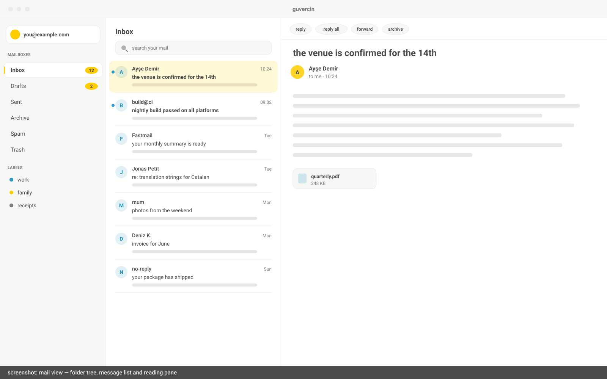
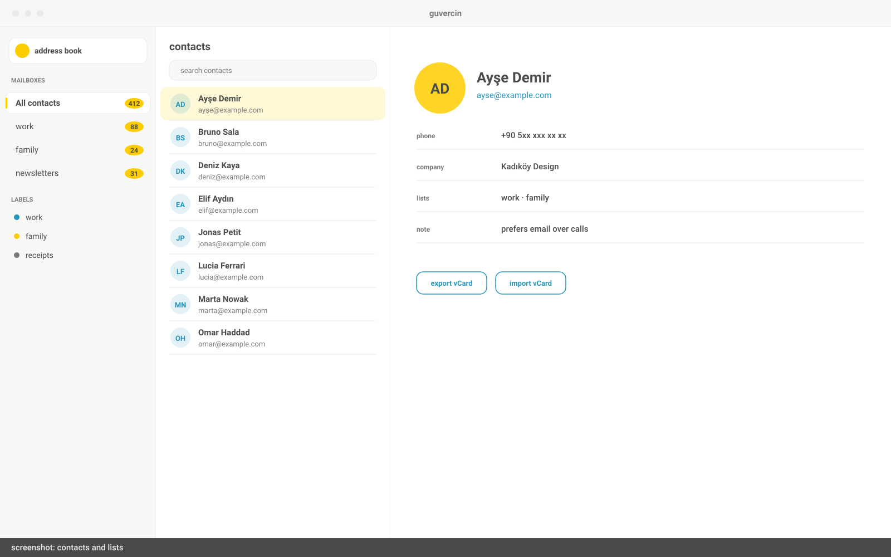
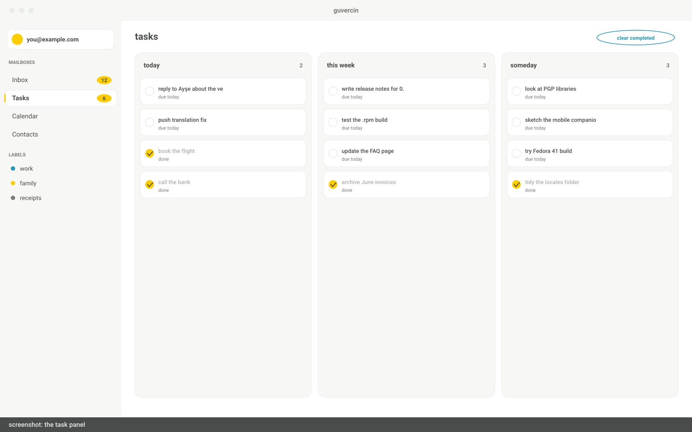
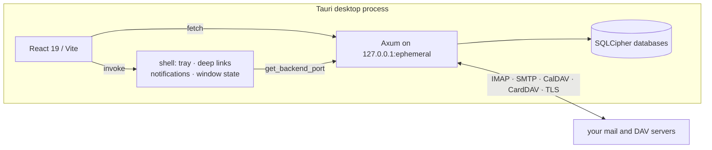

<div align="center">

<picture>
  <source media="(prefers-color-scheme: dark)" srcset="docs/logo-dark.svg">
  
</picture>

# guvercin

**your inbox, on your desktop**

a source-available desktop mail client for macOS, windows and linux — with a
calendar, contacts and tasks built in. your mail lives on your machine, not on ours.

**[download](https://github.com/herdem-herdem/guvercin-desktop/releases/latest)**
· [guvercin.email](https://guvercin.email)
· [build from source](#build-from-source)

<br>



</div>

---

## what it is

a desktop mail client that also carries the three things email is useless without:
an address book, a calendar and a task list. one window, one theme, one search bar.
rust and tauri underneath, react on top, sqlite all the way down.

**local first.** every message, contact, event and task sits in a sqlite database on
your disk. the app works with the network unplugged, queues what you do, and replays
it when the connection comes back — including attachments, inline images and search.

**encrypted at rest.** the databases are sqlcipher-encrypted and cached files are
sealed with xchacha20-poly1305. this cannot be switched off. read
[what that does and does not protect](#what-the-encryption-actually-protects)
before you rely on it.

**no cloud in the middle.** the app talks straight to your provider. no telemetry,
no crash reporting, no account to create, nothing of yours passes through a server
of ours.

---

## features

**mail** — any imap/smtp account, or one-click google sign-in over oauth2
(`xoauth2`, pkce in your system browser, no password typed into the app).
special-use folder detection, a conversation view you can switch off, a reading
pane you can move, advanced search, `.eml` import and export, a message source
viewer, and blocked senders. scripts, frames and inline event handlers are
stripped out of every message before it is displayed.

**compose** — a rich-text wysiwyg surface with a formatting ribbon, drag-and-drop
attachments, and a window you can pop out. right-click a file anywhere in your file
manager and pick *send with guvercin* to start a message with it attached.

**calendar, contacts, tasks** — month, week, day and agenda views with recurrence
and reminders; an address book with lists and vcard import/export; task lists with
due dates, priorities and subtasks. each one syncs two-way against google or your
own caldav/carddav server, or stays entirely local — your choice, per account.

**yours to shape** — light and dark themes plus follow-the-system, custom themes
imported from a json file, a per-account compose font, and every keyboard shortcut
rebindable. 64 interface languages ship with the app.

<div align="center">



</div>

---

## install

grab an installer from the
[latest release](https://github.com/herdem-herdem/guvercin-desktop/releases/latest):
a `.dmg` on macos, an `.exe` on windows, a `.deb` or `.rpm` on linux. there is no
separate backend to install or run — it is compiled into the binary.

## build from source

**prerequisites**

- node.js 20.19+, 22.12+ or 24+ (vite 7's floor)
- rust 1.77.2+
- a c toolchain — sqlcipher is compiled from source
- macos: xcode command line tools
- windows: msvc build tools and the webview2 runtime
- debian/ubuntu:

```bash
sudo apt install libwebkit2gtk-4.1-dev build-essential curl wget file libssl-dev libayatana-appindicator3-dev librsvg2-dev pkg-config
```

**then**

```bash
git clone https://github.com/herdem-herdem/guvercin-desktop.git
cd guvercin-desktop
npm install && npm --prefix frontend install
npm run app:build
```

installers land in `frontend/src-tauri/target/release/bundle/`.

---

## development

```bash
npm run app:dev
```

one command: vite dev server, rust backend compiled and launched inside the tauri
process, hot reload on the frontend.

| | command | from |
| --- | --- | --- |
| frontend only, in a browser | `npm run dev` | root |
| lint | `npm run lint` | root or `frontend/` |
| frontend tests | `npm test` | root or `frontend/` |
| backend tests | `cargo test` | `rust-backend/` |
| backend lints | `cargo clippy` | `rust-backend/` |
| backend on its own | `GUVERCIN_KEEP_ALIVE=1 cargo run` | `rust-backend/` |

frontend code is in `frontend/src` (pages, workspace components, utils, and 64
locale directories); the tauri shell — tray, deep links, file associations, window
state — is in `frontend/src-tauri`; the axum backend is in `rust-backend/src`, where
[lib.rs](rust-backend/src/lib.rs) registers every route.

`npm run lint` currently reports 84 pre-existing errors. ci reports them without
failing on them; that backlog is open work, so please do not add to it.

---

## how it works

one process. the tauri shell owns the window and the os integrations, starts the
axum server on a background thread, and hands the frontend the port it landed on.



the backend binds to `127.0.0.1:0`, so the os hands it a free ephemeral port and
nothing collides (macos holds 5000 for airplay). the frontend discovers the real
port through the tauri `get_backend_port` command — see
[api.js](frontend/src/utils/api.js). nothing listens on an external interface; the
http layer is an internal boundary, not a service.

---

## your data

| | |
| --- | --- |
| databases | `~/.guvercin/databases/` — `general.db` plus one `<account_id>.db` per account |
| master key | `<local app data>/com.guvercin.app/master.key` |

every sqlite file is opened through sqlcipher with a key derived per database from
a 256-bit master key held in zeroizing memory. attachments, inline assets and
avatars cached on disk are sealed with xchacha20-poly1305 in 64 kib chunks, each
with its own authentication tag ([crypto.rs](rust-backend/src/crypto.rs)). oauth
tokens are exchanged by the backend and never pass through the interface.

per-account databases mean deleting an account is deleting one file. set
`DATABASE_DIR` to move all of it somewhere else, an external volume included.
deleting `master.key` makes every database permanently unreadable — there is no
recovery path.

### what the encryption actually protects

the master key is stored as a **plain file in your user profile**. it is not
wrapped by the os keychain and not protected by a passphrase. on unix it is written
with mode 0600, so other local users cannot read it; on windows it inherits the
per-user acl of the local app data directory.

so: sqlcipher protects your mail from another account on the same machine, and from
anyone who reads the disk without that key. it does **not** protect you from
anything running as you — including malware in your own session — because that can
simply read the key. full-disk encryption is still your job. moving the key into
the platform keychain is open work.

two more things worth knowing before you trust this app with something sensitive:

- **remote images in the reading pane are not blocked yet.** opening a message
  fetches its images straight from the sender's server, which tells the sender you
  opened it and reveals your ip. the setting for this exists in the ui but is not
  wired to the rendering path.
- **the shipped google oauth client secret is public.** it is compiled into the
  binary because an installed desktop app has nowhere to hide it; pkce is what
  actually protects that flow.

the full threat model, and where to report a vulnerability, is in
[SECURITY.md](SECURITY.md).

---

## configuration

read from a git-ignored `.env` at the repository root in development, or baked in
at build time via `option_env!`.

| variable | purpose |
| --- | --- |
| `DATABASE_DIR` | move the databases (default `~/.guvercin/databases`) |
| `GOOGLE_CLIENT_ID` / `GOOGLE_CLIENT_SECRET` | use your own google oauth client |
| `GUVERCIN_KEEP_ALIVE` | keep a standalone backend running |
| `RUST_LOG` | backend log filter |

the app ships with a working oauth client, so gmail sign-in needs no setup. forks
wanting their own: create a **desktop app** client in the
[google cloud console](https://console.cloud.google.com/), enable the gmail api,
and copy `.env.example` to `.env`. no redirect uri to register — the loopback port
is random each time. resolution order is environment variable, build-time value,
shipped default; the client lives in [oauth.rs](rust-backend/src/oauth.rs).

---

## contributing

issues and pull requests are welcome. run `npm run lint`, `npm test` and
`cargo clippy` before opening one — ci runs the same three.

user-facing strings go through i18next: add the english key in
`frontend/src/locales/en/translation.json` and leave the other 63 files to a
translation pass. new locale directories are picked up automatically by the glob in
[i18n.js](frontend/src/i18n.js), so nothing else belongs under `src/locales/`.

anything touching `crypto.rs`, `keystore/`, `db.rs`, `oauth.rs` or the mail html
sanitiser needs a clear note on the security implications — see
[SECURITY.md](SECURITY.md).

---

## license

apache license 2.0 with a **commons clause** condition. use it, modify it,
redistribute it. you may not sell it, or sell a product or service whose value
derives substantially from it.

the commons clause makes this **source available, not open source** in the osi
sense — if that distinction matters to you, it should matter here. full terms in
[LICENSE](LICENSE).

copyright (c) 2026 hidayet erdem.
