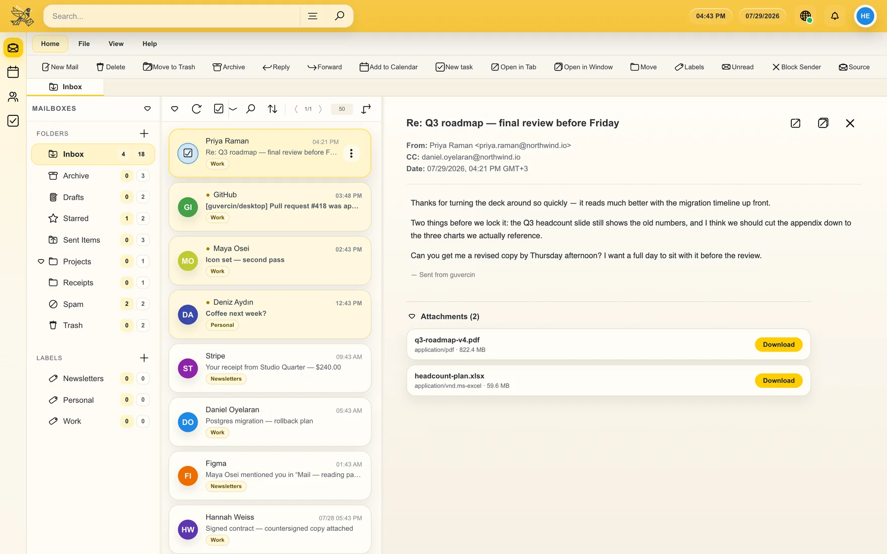
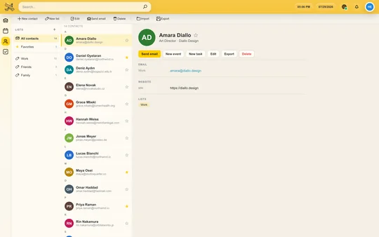
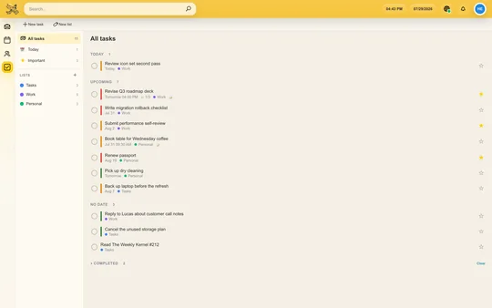
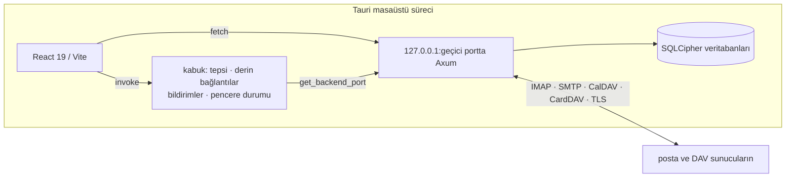

<div align="right"><a href="README.md">English</a> · <strong>Türkçe</strong></div>

<div align="center">

<picture>
  <source media="(prefers-color-scheme: dark)" srcset="docs/logo-dark.svg">
  
</picture>

# guvercin

**gelen kutun, kendi masaüstünde**

macOS, windows ve linux için kaynağı erişilebilir bir masaüstü posta istemcisi —
takvim, kişiler ve görevler de içinde. postan bizim değil, senin makinende durur.

**[indir](https://github.com/guvercin-email/guvercin-desktop/releases/latest)**
· [guvercin.email](https://guvercin.email)
· [tarayıcında dene](https://try.guvercin.email)
· [kaynaktan derle](#kaynaktan-derleme)

<sub>deneme sürümü, tarayıcı içi bir taklidin üzerinde çalışan gerçek arayüzdür:
imap yok, smtp yok, veritabanı yok, hesap yok — hiçbir şey sekmeden çıkmaz ve
sayfayı yenilemek her şeyi sıfırlar.</sub>

<br>

<picture>
  <source media="(prefers-color-scheme: dark)" srcset="docs/shot-mail-dark.webp">
  
</picture>

</div>

---

## ne bu

bir masaüstü posta istemcisi — ama e-postayı tek başına işe yaramaz kılan üç şeyi
de yanında taşıyor: bir adres defteri, bir takvim ve bir görev listesi. tek pencere,
tek tema, tek arama çubuğu. altta rust ve tauri, üstte react, en dipte sqlite.

**önce yerel.** her ileti, kişi, etkinlik ve görev diskindeki bir sqlite
veritabanında durur. uygulama ağ fişi çekilmişken de çalışır, yaptıklarını kuyruğa
alır ve bağlantı geri geldiğinde tekrar oynatır — ekler, satır içi görseller ve
arama dahil.

**diskte şifreli.** veritabanları sqlcipher ile şifrelenir, önbelleğe alınan
dosyalar xchacha20-poly1305 ile mühürlenir. bu kapatılamaz. güvenmeden önce
[bunun neyi koruyup neyi korumadığını](#şifreleme-gerçekte-neyi-koruyor) oku.

**arada bulut yok.** uygulama doğrudan kendi sağlayıcınla konuşur. telemetri yok,
çökme raporu yok, açılacak hesap yok; sana ait hiçbir şey bizim bir sunucumuzdan
geçmez.

---

## özellikler

**posta** — herhangi bir imap/smtp hesabı ya da oauth2 üzerinden tek tıkla google
girişi (`xoauth2`, sistem tarayıcında pkce, uygulamaya parola yazılmaz). özel
amaçlı klasör tespiti, kapatabildiğin sohbet görünümü, taşıyabildiğin okuma
bölmesi, gelişmiş arama, `.eml` içe/dışa aktarma, ileti kaynağı görüntüleyici ve
engellenen göndericiler. her ileti gösterilmeden önce içindeki betikler, çerçeveler
ve satır içi olay işleyicileri temizlenir; uzak görseller sen isteyene kadar
tutulur — yani bir iletiyi açman göndericiye açtığını haber vermez.

**oluşturma** — biçimlendirme şeridi olan zengin metin yüzeyi, sürükle-bırak
ekler ve dışarı çıkarabildiğin bir pencere. dosya yöneticinde herhangi bir dosyaya
sağ tıklayıp *guvercin ile gönder* dersen, dosya eklenmiş halde bir ileti başlar.

**takvim, kişiler, görevler** — yinelenme ve hatırlatmalarla ay, hafta, gün ve
ajanda görünümleri; listeler ve vcard içe/dışa aktarma içeren bir adres defteri;
bitiş tarihi, öncelik ve alt görevleri olan görev listeleri. her biri google ya da
kendi caldav/carddav sunucunla iki yönlü eşitlenir, veya tamamen yerel kalır —
hesap başına senin seçimin.

**senin şekillendirdiğin** — açık ve koyu temalar ile sistemi izleme seçeneği, bir
json dosyasından içe aktarılan özel temalar, hesap başına yazı tipi ve yeniden
atanabilir her klavye kısayolu. uygulama 64 arayüz diliyle geliyor.

<div align="center">
<picture>
  <source media="(prefers-color-scheme: dark)" srcset="docs/shot-calendar-dark.webp">
  
</picture>
<picture>
  <source media="(prefers-color-scheme: dark)" srcset="docs/shot-contacts-dark.webp">
  
</picture>
<picture>
  <source media="(prefers-color-scheme: dark)" srcset="docs/shot-tasks-dark.webp">
  
</picture>
</div>

---

## kurulum

bir yükleyiciyi
[son sürümden](https://github.com/guvercin-email/guvercin-desktop/releases/latest)
al: macos'ta `.dmg`, windows'ta `.exe`, linux'ta `.deb`, `.rpm` ya da `.appimage`.
ayrıca kurulacak veya çalıştırılacak bir arka uç yok — ikilinin içine derleniyor.

paketler **imzasız** — kod imzalama sertifikası bu projenin henüz taşımadığı yıllık
bir masraf — bu yüzden ilk açılış reddediliyor. macos uygulamayı "zarar görmüş"
diye bildirir: Applications içinde sağ tıkla, **aç** de, sonra tekrar **aç**;
macos bunu hatırlar. windows'ta smartscreen **daha fazla bilgi** → **yine de
çalıştır** sunar. linux şikâyet etmez. bu takası yapmak istemiyorsan
[kaynaktan derle](#kaynaktan-derleme).

aynı masaüstü bütünleşmeleri üçünde de kuruluyor: guvercin varsayılan `mailto:` ve
`.eml` işleyicin olabilir, ilk açılışta dosya yöneticisine *guvercin ile gönder*
girdisini kurar (finder hızlı eylemi, explorer sağ tık menüsü girdisi, nautilus,
dolphin, nemo ve thunar için eklentiler), okunmamış sayısını dock, başlatıcı veya
görev çubuğunda gösterir ve ayarlar → gelişmiş bölümünden kendini kaldırır.

linux'ta başlatıcı sayacı `com.canonical.Unity.LauncherEntry` d-bus sinyaliyle
gider — kde görev yöneticisi, dash to dock, cinnamon ve dock'ların hepsinin
dinlediği sinyal — yalnızca gerçek bir unity oturumunda bulunan `libunity`
üzerinden değil.

## kaynaktan derleme

**gerekenler**

- node.js 20.19+, 22.12+ veya 24+ (vite 7'nin alt sınırı)
- rust 1.77.2+
- bir c araç zinciri — sqlcipher kaynaktan derleniyor
- macos: xcode command line tools
- windows: msvc build tools ve webview2 çalışma zamanı
- debian/ubuntu:

```bash
sudo apt install libwebkit2gtk-4.1-dev build-essential curl wget file libssl-dev libayatana-appindicator3-dev librsvg2-dev pkg-config
```

**sonra**

```bash
git clone https://github.com/guvercin-email/guvercin-desktop.git
cd guvercin-desktop
npm install && npm --prefix frontend install
npm run app:build
```

yükleyiciler `frontend/src-tauri/target/release/bundle/` altına düşer.

---

## geliştirme

```bash
npm run app:dev
```

tek komut: vite geliştirme sunucusu, tauri sürecinin içinde derlenip başlatılan
rust arka ucu, ön yüzde sıcak yeniden yükleme.

| | komut | nereden |
| --- | --- | --- |
| sadece ön yüz, tarayıcıda | `npm run dev` | kök |
| lint | `npm run lint` | kök veya `frontend/` |
| ön yüz testleri | `npm test` | kök veya `frontend/` |
| arka uç testleri | `cargo test` | `rust-backend/` |
| arka uç lint | `cargo clippy` | `rust-backend/` |
| arka uç tek başına | `GUVERCIN_KEEP_ALIVE=1 cargo run` | `rust-backend/` |
| kabuk testleri + lint | `cargo test` / `cargo clippy` | `frontend/src-tauri/` |

ön yüz kodu `frontend/src` içinde (sayfalar, bölüm bileşenleri, yardımcılar ve 64
locale dizini); tauri kabuğu — tepsi, derin bağlantılar, dosya ilişkilendirmeleri,
pencere durumu — `frontend/src-tauri` içinde, işletim sistemine özgü her şey
[src/platform](frontend/src-tauri/src/platform/mod.rs) altında tek bir cephenin
arkasında: `shared.rs` platformdan bağımsız yarıları tutar (ve her makinede çalışan
testlerini), `macos.rs`, `windows.rs` ve `unix.rs` ise gerçekten farklılaşan
çağrıları. axum arka ucu `rust-backend/src` içinde; her rotayı
[lib.rs](rust-backend/src/lib.rs) kaydeder.

lint temiz ve ci bunu zorunlu tutuyor, `npm test` ve `cargo clippy` ile birlikte.
ci ayrıca tauri kabuğunu üç işletim sisteminde de derleyip test ediyor, çünkü her
biri platform modülünün farklı bir yarısını derliyor. eslint, clippy ve vite
derlemesi uyarısız çalışır; bilinçli olan iki `react-hooks/exhaustive-deps`
durumu, sebebini açıklayan satır içi bir devre dışı bırakma taşır.

açılış parçası yalnızca uygulama çekirdeğini taşır. pakete gömülü tek locale
ingilizce — diğer 63'ü dil başına indirilir — ve ayar ekranları, ayrılmış
pencereler, takvim/kişiler/görevler bölümleri ile pdf dışa aktarma yolu istendiğinde
yüklenir. yeni bir ekran eklerken bunu koru: ilk boyama gerçekten gerektirmiyorsa
`lazy()` kullan.

---

## nasıl çalışıyor

tek süreç. tauri kabuğu pencereye ve işletim sistemi bütünleşmelerine sahiptir,
axum sunucusunu arka planda bir iş parçacığında başlatır ve ön yüze hangi porta
düştüğünü söyler.



arka uç `127.0.0.1:0` adresine bağlanır, yani işletim sistemi ona boş bir geçici
port verir ve hiçbir çakışma olmaz (macos 5000'i airplay için tutar). ön yüz gerçek
portu tauri `get_backend_port` komutuyla öğrenir — bkz.
[api.js](frontend/src/utils/api.js). dışarıya açık hiçbir arayüzde dinleme yok;
http katmanı bir servis değil, içeride bir sınır.

---

## verilerin

| | |
| --- | --- |
| veritabanları | `~/.guvercin/databases/` — `general.db` artı hesap başına bir `<account_id>.db` |
| ana anahtar | `<yerel uygulama verisi>/com.guvercin.app/master.key` |

her sqlite dosyası, sıfırlanan bellekte tutulan 256 bitlik bir ana anahtardan
veritabanı başına türetilen bir anahtarla sqlcipher üzerinden açılır. diskte
önbelleğe alınan ekler, satır içi varlıklar ve avatarlar 64 kib'lik parçalar
halinde xchacha20-poly1305 ile mühürlenir; her parçanın kendi kimlik doğrulama
etiketi vardır ([crypto.rs](rust-backend/src/crypto.rs)). oauth jetonları arka uç
tarafından değiş tokuş edilir ve arayüzden hiç geçmez.

hesap başına veritabanı demek, bir hesabı silmenin tek bir dosyayı silmek olması
demek. hepsini başka bir yere — harici bir diske de — taşımak için `DATABASE_DIR`
ayarla. `master.key` dosyasını silmek her veritabanını kalıcı olarak okunamaz
yapar; geri dönüş yolu yoktur.

### şifreleme gerçekte neyi koruyor

ana anahtar, kullanıcı profilinde **düz bir dosya olarak** durur. işletim sistemi
anahtarlığıyla sarmalanmaz ve bir parola ile korunmaz. unix'te 0600 kipiyle
yazılır, yani aynı makinedeki diğer yerel kullanıcılar okuyamaz; windows'ta yerel
uygulama verisi dizininin kullanıcı başına acl'sini devralır.

yani: sqlcipher postanı aynı makinedeki başka bir hesaptan ve o anahtar olmadan
diski okuyan birinden korur. **senin olarak çalışan hiçbir şeye karşı korumaz** —
kendi oturumundaki zararlı yazılım dahil — çünkü o şey anahtarı okuyabilir. tam
disk şifrelemesi hâlâ senin işin. anahtarı platform anahtarlığına taşımak açık bir
iş kalemi.

bilmeye değer bir şey daha: **pakete gömülü google oauth istemci parolası
herkese açıktır.** kurulu bir masaüstü uygulamasının onu saklayacak yeri olmadığı
için ikilinin içine derlenir; o akışı asıl koruyan şey pkce'dir.

tam tehdit modeli ve bir güvenlik açığının nereye bildirileceği
[SECURITY.md](SECURITY.md) içinde.

---

## yapılandırma

geliştirmede depo kökündeki git tarafından yok sayılan bir `.env` dosyasından
okunur, ya da derleme sırasında `option_env!` ile gömülür.

| değişken | ne işe yarar |
| --- | --- |
| `DATABASE_DIR` | veritabanlarını taşır (varsayılan `~/.guvercin/databases`) |
| `GOOGLE_CLIENT_ID` / `GOOGLE_CLIENT_SECRET` | kendi google oauth istemcini kullanmak için |
| `GUVERCIN_KEEP_ALIVE` | arka ucu tek başına çalışır tutar |
| `RUST_LOG` | arka uç günlük filtresi |

uygulama çalışan bir oauth istemcisiyle geliyor, yani gmail girişi için kurulum
gerekmiyor. kendi istemcisini isteyen çatallar:
[google cloud console](https://console.cloud.google.com/) üzerinde bir **desktop
app** istemcisi oluştur, gmail api'sini etkinleştir ve `.env.example` dosyasını
`.env` olarak kopyala. kaydedilecek bir yönlendirme adresi yok — loopback portu her
seferinde rastgele. çözümleme sırası: ortam değişkeni, derleme zamanı değeri,
pakete gömülü varsayılan; istemci [oauth.rs](rust-backend/src/oauth.rs) içinde.

---

## katkı

issue'lar ve pull request'ler bekleriz. birini açmadan önce `npm run lint`,
`npm test` ve `cargo clippy` çalıştır — ci de aynı üçünü çalıştırıyor.

kullanıcıya görünen metinler i18next üzerinden geçer: ingilizce anahtarı
`frontend/src/locales/en/translation.json` içine ekle, diğer 63 dosyayı bir çeviri
turuna bırak. yeni locale dizinleri [i18n.js](frontend/src/i18n.js) içindeki glob
tarafından kendiliğinden bulunur, yani `src/locales/` altına başka bir şey
konmamalı. çalışma zamanında dil değiştirmek için `i18n.changeLanguage()` yerine o
modüldeki `changeLanguage()` kullan; böylece locale değişimden önce yüklenir.

`crypto.rs`, `keystore/`, `db.rs`, `oauth.rs` veya posta html temizleyicisine
dokunan her şeyin güvenlik etkileri hakkında net bir not taşıması gerekir — bkz.
[SECURITY.md](SECURITY.md).

---

## lisans

**commons clause** koşuluyla birlikte apache license 2.0. kullanabilir,
değiştirebilir, yeniden dağıtabilirsin. satamazsın; değerinin büyük kısmı ondan
gelen bir ürün ya da hizmet de satamazsın.

commons clause bunu osi anlamında **açık kaynak değil, kaynağı erişilebilir**
yapar — bu ayrım senin için önemliyse, burada da önemli olmalı. tam koşullar
[LICENSE](LICENSE) içinde.

copyright (c) 2026 hidayet erdem.
